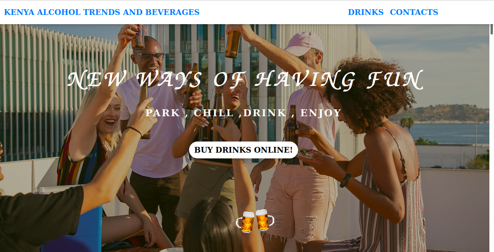

### **KENYA ALCOHOL TRENDS AND BEVERAGES**
# **Author - GROUP (KATAB)**
_This  project features a DRINKS WEB APP CALLED "KENYA ALCOHOL TRENDS AND BEVERAGES"._

## Description

This online web application allows users to make orders online.The Web page sells a variety of alcoholic drinks and beverages.

#### **User Stories**

A a customer, I would like to;

1. Choose the size/quantity of DRINK I want e.g 750ml .500ml ,250ml
2. Choose what kind of chaser I would like to accompany my drink (optional).g soda, tonic water, energy drink, juice , water.
3. Choose the fruitslices I want for my drink (optional).
4. Place an order for my drink and see the total charge for it.
5. Have an option to order as many drinks as I want.
6. Have an option to have my order delivered or not.  If delivered I want to be alerted how much the delivery charge will be.
7. If I want my drink to be delivered, I want to be prompted to enter where the delivery should be made and an alert saying '' your order will be delivered to your location"
8. See a checkout button that when clicked shows the total amount charged for the orders.

 (LANDING PAGE)
 (ABOUT SECTION)
 (DRINKS SECTION)
(BEVERAGES SECTION)
 (ORDER SECTION)
 (CONTACT SECTION)

#### **PROJECT OBJECTIVES**
1. The project code uses constructors in Javascript.
2. The project makes use of prototypes in Javascript.
3. The project implements one or more Javascript functions.
4. The project separates the business logic code from the UI logic code.
5. The web app uses bootstrap and media queries to make it fully responsive.
6. The javascript code uses the correct syntax of camel case naming of variables. I.e var myVariable = "stores something"; instead of var my_var = "stores something", or, var MyVar = "stores something" , or,  var my-Var = "stores something"
7. The project uses JQUERRY functions.
8. use Bootstrap functions.
9. Use CSS functions.

#### **REQUIREMENTS**

## **KATAB WEB APP.**
1. Determine the prices for each alcohol and beverage size.
2. Each fruitslice should have a set value depending on type of drink.
3. Determine the cost for the chaser.
4. The total cost of  drinks should constitute, chaser, fruitslice and quantity of alcohol purchased.
5. On checkout, the application displays the orders’ summary together with the total amount charged. For example, if the customer has made more than one drink order, on checkout the application displays a summary of all the orders he/she has made and the total amount to pay for all his/her orders.

## Installation and Set-up
To view the webpage, open the Github Pages link provided below on the README.

Here is a systematic setup of how to template the Website
* Step 1 : Clone this repository **`https://github.com/tailorv/katab.git`**,or downloading a ZIP file of the code.
* Step 2 : The repository, if downloaded as a .zip file will need to be extracted to your preferred location and opened
* Step 3 : Open the index.html file to view the webpage on your preferred browser

## Github Pages link

You can view the live webpage by following this link https://tailorv.github.io/katab/

#### **CONTACT**
>Maxwell.Munene@student.moringaschoolcom  
>duke.ancel@student.moringaschoolcom  
>joy.wadi1000@student.moringaschoolcom  
>olive.wangui@student.moringaschoolcom  

#### **COPYRIGHT & LICENCE**
Distributed under the MIT License. See LICENSE for more information on license and copyright.
